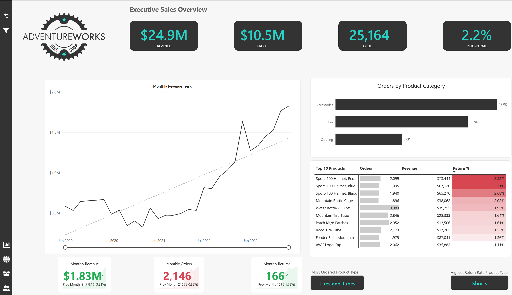
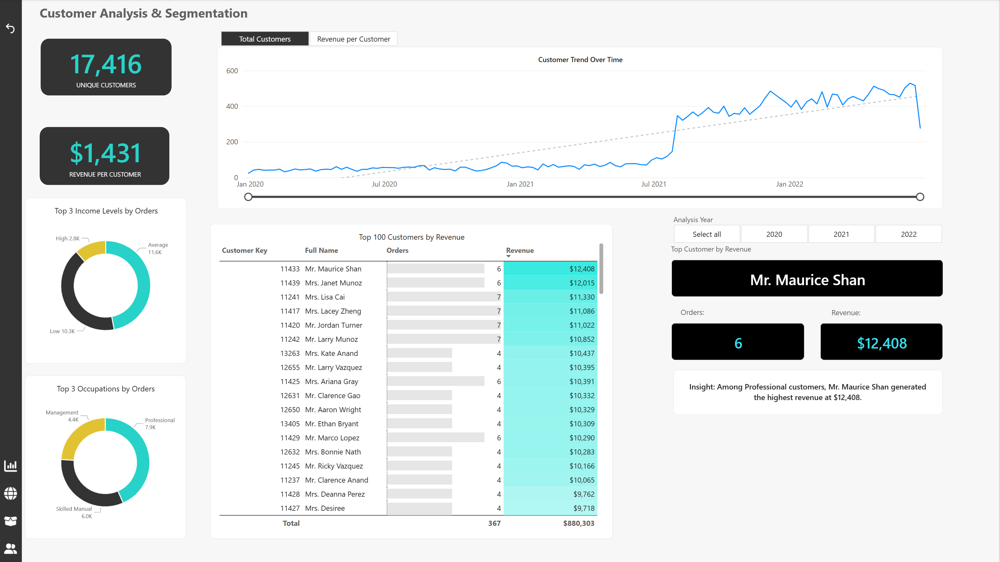
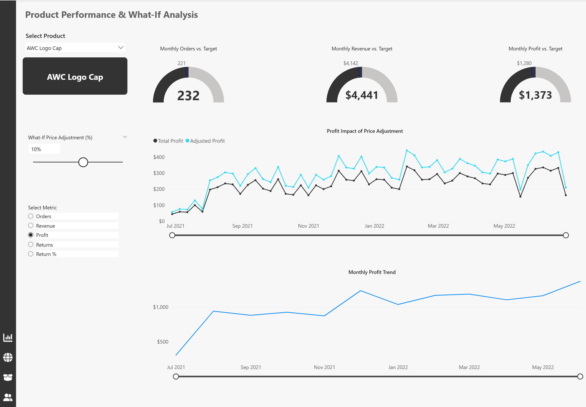
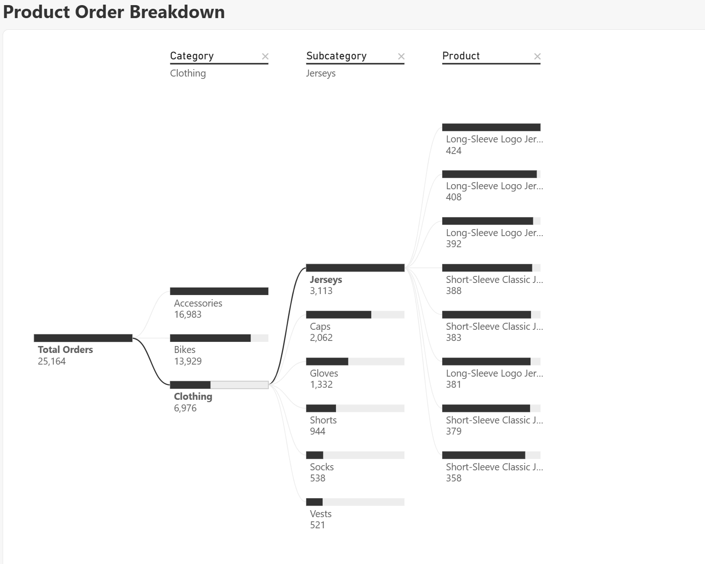
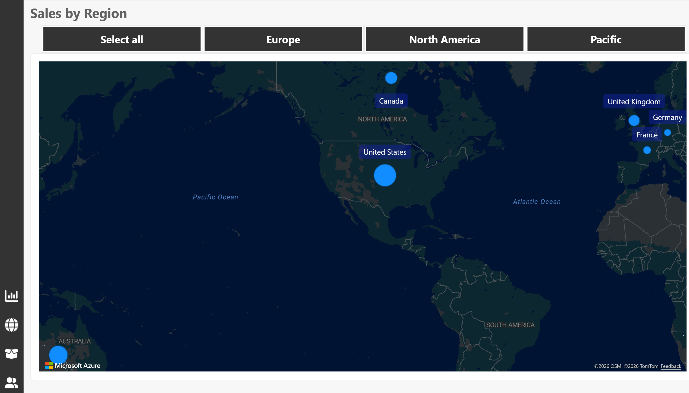
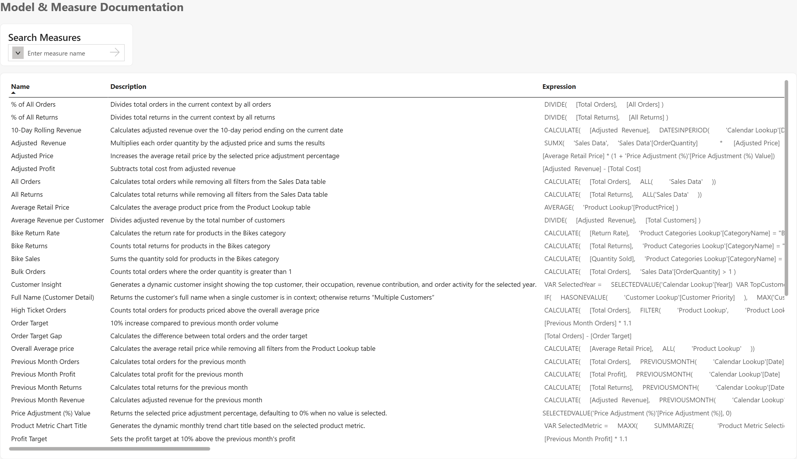

# AdventureWorks Power BI Business Intelligence Analysis

An end-to-end Power BI business intelligence project analyzing AdventureWorks sales, customer, product, and regional performance.

The solution combines data modelling, DAX measures, interactive dashboards, customer analytics, product analysis, geospatial analysis, what-if analysis, dynamic metric selection, and model documentation to support data-driven decision-making.

## Project Overview

This project was developed to transform AdventureWorks transactional data into an interactive business intelligence solution that provides insight into overall business performance.

The analysis focuses on:

- Sales and profitability performance
- Order and return trends
- Product and category performance
- Customer behaviour and segmentation
- Geographic sales patterns
- Product-level performance
- What-if price adjustment analysis
- KPI and target monitoring
  
## Source Files

The source data used to build the Power BI report is included in this repository:

- `AdventureWorks Calendar Lookup.csv`
- `AdventureWorks Customer Lookup.csv`
- `AdventureWorks Product Categories Lookup.csv`
- `AdventureWorks Product Lookup.csv`
- `AdventureWorks Product Subcategories Lookup.csv`
- `AdventureWorks Returns Data.csv`
- `AdventureWorks Sales Data 2020.csv`
- `AdventureWorks Sales Data 2021.csv`
- `AdventureWorks Sales Data 2022.csv`
- `AdventureWorks Territory Lookup.csv`
- `Product Category Sales (Unpivot Demo).csv`

## Power BI Report File

The completed Power BI report is included in this repository:

**[View / Download the AdventureWorks Power BI Report](AdventureWorks%20Report.pbix)**

## Executive Dashboard

The executive dashboard provides a high-level view of business performance, combining headline KPIs with monthly trends, product category performance, return analysis, and product-level results.

## Customer Analysis

Customer analytics provide insight into customer behaviour, revenue contribution, order activity, and customer segments.

## Product Performance & What-If Analysis

The product analysis page enables product-level performance evaluation using KPI targets, dynamic metric selection, and a what-if price adjustment parameter.

This allows users to assess how hypothetical pricing changes could affect product profitability while monitoring orders, revenue, profit, returns, and return rates.

## Product Order Breakdown

A decomposition tree provides an interactive way to investigate order performance across multiple business dimensions and identify the factors contributing to product demand.

## Geographic Analysis

Regional analysis provides a geographic view of sales activity and helps identify differences in business performance across markets.

## Data Model & Measure Documentation

The Power BI solution uses a structured analytical model with fact and dimension tables, relationships, calculated measures, and supporting documentation.

## Key Analytical Features

- Executive KPI dashboard
- Sales and profitability trend analysis
- Customer segmentation
- Product performance analysis
- Dynamic metric selection
- What-if price adjustment analysis
- KPI target comparison
- Return analysis
- Geospatial analysis
- Decomposition tree analysis
- DAX measures and time intelligence
- Data model and measure documentation

## Tools & Skills Demonstrated

**Tools**
- Power BI
- Power Query
- DAX

**Skills**
- Business Intelligence
- Data Modelling
- KPI Development
- Data Visualization
- Customer Analytics
- Sales Analytics
- What-If Analysis
- Dynamic Measures
- Geospatial Analysis
- Decomposition Trees
- Business Analysis
- Technical Documentation

## Portfolio Case Study

For the full project walkthrough, business analysis, dashboard explanations, insights, and recommendations:

[View the AdventureWorks Case Study](https://nnamdionu.github.io/adventureworks.html)

## Author

**Nnamdi Onu**  
Business Analyst | Data Analyst | Business Intelligence
